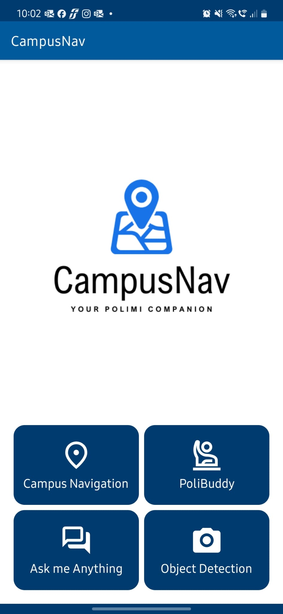
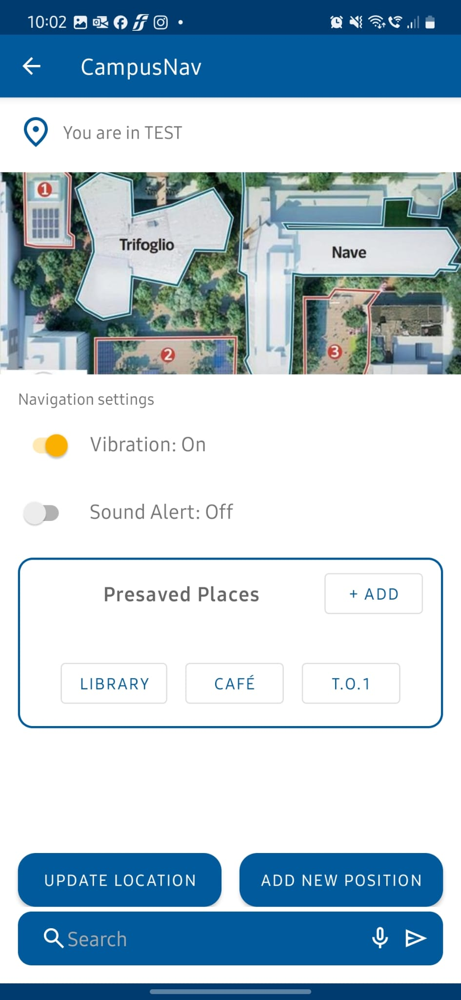
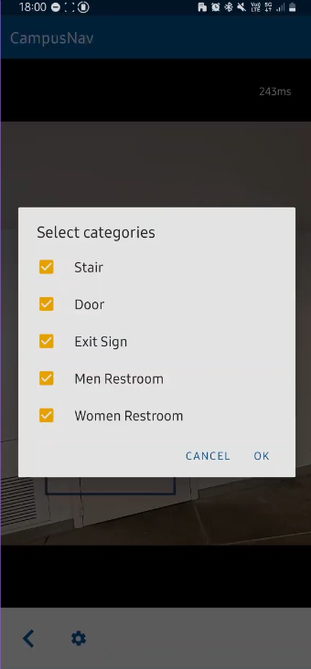
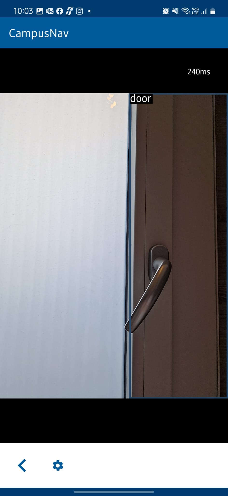
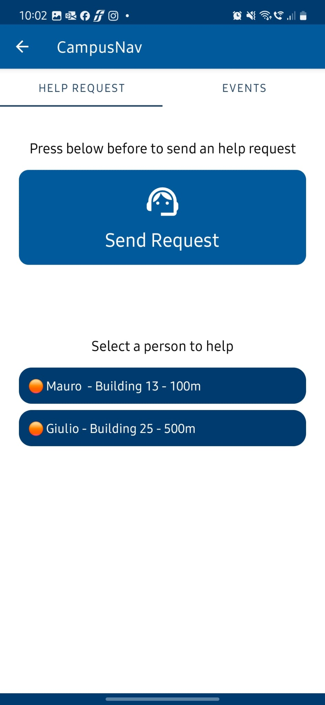

# 🎓 Campus Nav — Indoor Navigation Assistant, tailored for Visually Impaired People @ Politecnico di Milano

[](https://developer.android.com)
[](LICENSE)
[](#academic-context)
[](https://kotlinlang.org)
[](https://www.w3.org/WAI/standards-guidelines/wcag/)

**Campus Nav** is an innovative Android application developed as part of the course **IDT - Inclusive Digital Technologies (A.Y. 2024–2025)** at **Politecnico di Milano**. Designed with **accessibility at its core**, Campus Nav empowers **👨‍🦯 blind and visually impaired users** to navigate the university's indoor environments independently, confidently, and safely.

---

## 🎥 Demonstration
Watch the video below to see the tool in action:

[](https://www.youtube.com/watch?v=amo7py3NDTQ)

---

## 📚 Table of Contents

- [📦 Installation Instructions](#-installation-instructions)
  - [🛠 Android App](#-android-app)
  - [🧠 Local LLM Backend Setup (Gemma3)](#-local-llm-backend-setup-gemma3)
    - [🧾 Requirements](#-requirements)
    - [📂 Script Location](#-script-location)
    - [🌐 IP Configuration](#-ip-configuration)
- [🛠️ Technology Stack](#-technology-stack)
- [👨‍🦯 A Mission-Driven App](#-a-mission-driven-app)
- [🚀 Key Features](#-key-features)
  - [📍 Wi-Fi Based Indoor Navigation](#-wi-fi-based-indoor-navigation)
  - [📷 Camera Vision with YOLOv8](#-camera-vision-with-yolov8)
  - [🎥 GEMMA3 Video Interaction](#-gemma3-video-interaction)
  - [🤝 PoliBuddy Assistance System](#-polibuddy-assistance-system)
- [🏛️ Built for Politecnico di Milano](#-built-for-politecnico-di-milano)
- [📁 Project Structure](#-project-structure)
- [🎨 Layouts and UI Design](#-layouts-and-ui-design)
- [🤝 Contributing](#-contributing)
- [🧠 Academic Context](#-academic-context)
- [📜 License](#-license)
- [💡 Our Vision](#-our-vision)

---

# 📦 Installation Instructions

Clone the repository
```bash
git clone https://github.com/yourusername/campus-nav.git
```

## 🛠 Android App
1. Open the project in Android Studio
2. Connect a physical Android device
3. Build and Run the app
4. Make sure to grant the following permissions:

- 📍 Location

- 📷 Camera

- 🌐 Network access

## 🧠 Local LLM Backend Setup (Gemma3)
Campus Nav uses a local large language model (LLM) to analyze video content for accessibility support. This backend script is used to interact with the LLM (e.g., Ollama + Gemma3).

### 🧾 Requirements
- Python 3.8+
- Ollama installed (https://ollama.com)
- Ollama Gemma model downloaded locally:

```bash
ollama pull gemma3:4b
```

### FastAPI & dependencies:

```bash
pip install fastapi uvicorn pydantic pillow opencv-python ollama
```

### 📂 Script Location
The backend Python script is located at:

```bash
docs/gemma3Server.py
```

You can run it with:

```bash
uvicorn gemma3Server:app --host 0.0.0.0 --port 8000
```

### 🌐 IP Configuration
To enable the Android app to communicate with the local server:

In your Android device (or emulator), make sure the backend is accessible (same WiFi network).

Modify the server IP address inside:

```kotlin
GemmaActivity.kt
```

Look for a variable or constant like:

```kotlin
val SERVER_URL = "http://192.168.X.X:8000"
```

Replace 192.168.X.X with your computer’s local IP address.

### 📌 Important: This backend is temporary and meant for local testing purposes only. Future versions may integrate a cloud-hosted endpoint.

---

## 🛠️ Technology Stack

- Kotlin, Android SDK

- YOLOv8 + TensorFlow Lite

- Google FusedLocationProviderClient

- Custom Wi-Fi signal processing

- GEMMA3 video intelligence API

- Material Design Accessibility Guidelines

---

## 👨‍🦯 A Mission-Driven App

Campus Nav is more than just a navigation tool — it's a **digital companion** tailored to the unique needs of visually impaired students and visitors. With real-time indoor positioning, object recognition, and intelligent assistance, it bridges the gap between physical space and digital accessibility.

Every feature in this app is designed to **enhance independence, confidence, and safety** for users with visual impairments. From audio feedback to intuitive gestures, the user experience is crafted to ensure:

- 👐 Hands-free operation where possible  
- 🗣️ Screen reader compatibility  
- 🧭 Minimal UI complexity for ease of use  
- 🎙️ Audio feedback and voice guidance  
- 🌗 High contrast visuals and accessible gestures

---

## 🚀 Key Features

### 📍 Wi-Fi Based Indoor Navigation
Leverages the strength of campus Wi-Fi signals to determine the user’s location without relying on GPS:

- Accurate room/hallway-level positioning  
- Optimized for Politecnico di Milano’s infrastructure  
- Low battery consumption, passive localization  

### 📷 Camera Vision with YOLOv8
Uses a YOLOv8 object detection model to recognize key indoor elements through the camera:

- 🚪 Doors  
- 🪜 Stairs  
- 🚻 Bathrooms  
- 🚨 Exit signs  

Provides real-time **audio feedback** to describe the environment and enhance orientation.

### 🎥 GEMMA3 Video Interaction
Allows users to **record or select a video**, upload it to a server, and interact with an intelligent assistant:

- Receive concise summaries of video content  
- Ask questions about what’s in the video  
- Understand unfamiliar environments before visiting them  

### 🤝 PoliBuddy Assistance System
An in-app support feature for both **real-time help and future planning**:

- Send immediate assistance requests  
- Schedule events like 🍽️ lunch breaks or 🚶‍♂️ daily routes  
- Designed for proactive and inclusive support

---

## 🏛️ Built for Politecnico di Milano

Campus Nav is custom-built for the **Politecnico di Milano** campus using real-world data and layouts. It reflects a commitment to:

- Inclusive design in academic spaces  
- Smart digital infrastructure  
- Equal access to education and mobility for all students  

---

### 📁 Project Structure

```bash
IDT-app/
├── app/
│   ├── src/
│   │   ├── main/
│   │   │   ├── java/com/tech4all/idt/
│   │   │   │   ├── MainActivity.kt              # Main dashboard with navigation buttons
│   │   │   │   ├── wifiLocalization/
│   │   │   │   │   └── WiFiActivityMain.kt      # Indoor navigation via Wi-Fi signals
│   │   │   │   ├── yolov8tflite/
│   │   │   │   │   └── CameraActivity.kt        # Real-time object detection with YOLOv8
│   │   │   │   ├── gemma3/
│   │   │   │   │   └── GemmaActivity.kt         # Upload & query videos with GEMMA3
│   │   │   │   ├── poliBuddy/
│   │   │   │   │   └── PoliBuddyActivity.kt     # Help request and activity planning
│   │   │   └── res/
│   │   │       ├── layout/                      # UI XML layouts
│   │   │       ├── values/                      # Strings, themes, dimensions
│   │   │       └── drawable/                    # Icons, backgrounds
│   ├── AndroidManifest.xml                      # App permissions and declarations
│   └── build.gradle                             # App-level Gradle config
├── build.gradle                                 # Project-level Gradle config
├── README.md                                    # Project overview and documentation
├── docs                                         # Documents produced during the development
└── LICENSE                                      # Open-source license (MIT)
```
---

## 🎨 Layouts and UI Design

The app’s user interface is built using **Android XML layout files** located in the `app/src/main/res/layout/` directory. Each screen and component has its own dedicated layout to ensure a clean, intuitive, and accessible user experience.

<p float="left">
  
  
  
  
  
</p>


---

## 🤝 Contributing
We welcome suggestions, bug reports, and contributions, especially in areas like:

- Improving localization accuracy

- Enhancing the object detection model

- Expanding accessibility support (e.g. gesture input)

- UI testing with screen readers and TalkBack

---

## 🧠 Academic Context
This project was developed for:

- Course: IDT - Inclusive Digital Technologies
- Academic Year: 2024–2025
- Institution: Politecnico di Milano

---

## 📜 License
This project is licensed under the MIT License.
Use it freely for educational, research, or accessibility-driven development.

---

## 💡 Our Vision
“Accessibility is not a feature — it’s a foundation. Campus Nav proves that inclusive, user-centered design can transform ordinary spaces into empowering environments for all.”

